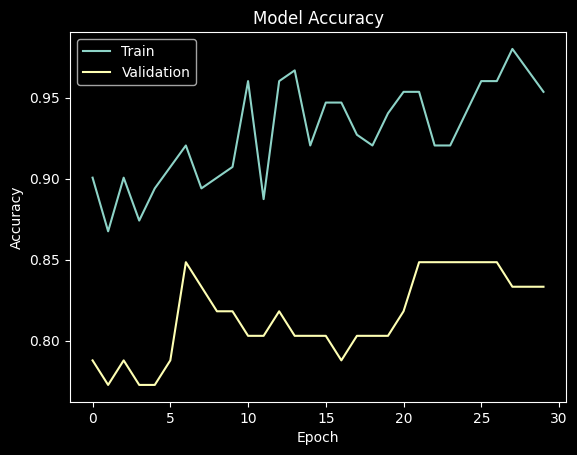
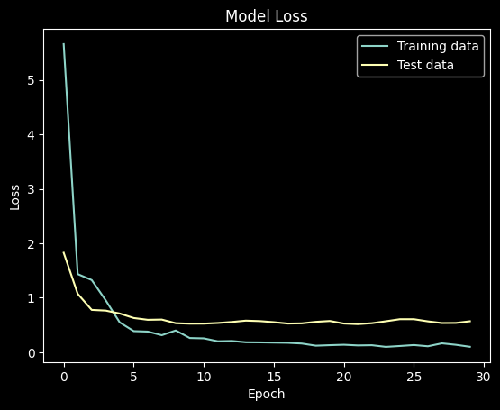
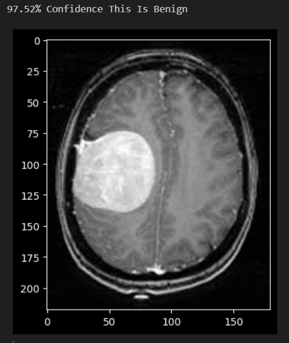
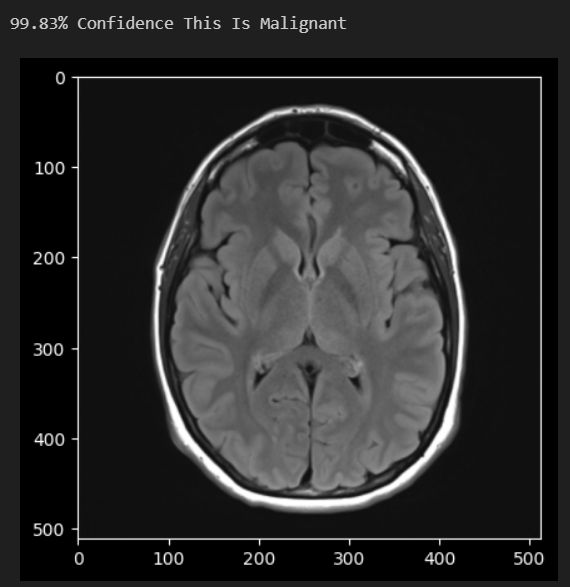

# MRI Brain Tumor Classification

## **Problem Statement**
To classify MRI scan images into two categories:
- **Benign**: Indicating a non-cancerous brain tumor.
- **Malignant**: Indicating a cancerous and potentially dangerous brain tumor.

---

## **Methodology**

### **Step 1: Dataset Preparation**
- Downloaded the MRI image dataset from Kaggle.
- Combined all images from both categories into a list.
- Created a separate list for labels using one-hot encoding:
  - **Label 0**: "No Tumor" (Benign)
  - **Label 1**: "Tumor" (Malignant)

### **Step 2: Data Preprocessing**
- Shuffled the dataset and split it into training and testing sets using Scikit-learn.

### **Step 3: Model Definition**
- Utilized Keras to define and train the model:
  - Initialized a `Sequential` model and progressively added layers.
  - **Convolutional Layers**: Added two convolutional layers with:
    - 32 filters
    - 3x3 kernel size
    - Padding
    - ReLU activation
  - **Max Pooling and Dropout Layers**: Added:
    - A max pooling layer (2x2 pool size)
    - A dropout layer for regularization.

### **Step 4: Advanced Layers**
- Added two additional convolutional layers with:
  - 64 filters
  - Padding
  - ReLU activation
- Followed by another max pooling layer and a dropout layer.

### **Step 5: Flattening and Dense Layers**
- Added a flatten layer to convert feature maps into a single-column vector.
- Added a dense output layer with:
  - 2 neurons (representing labels 0 and 1)
  - Softmax activation.

### **Step 6: Model Compilation and Training**
- Compiled the model with:
  - **Loss Function**: Categorical Crossentropy
  - **Optimizer**: Adamax
- Trained the model using the training and testing datasets.

### **Step 7: Evaluation**
- Plotted the accuracy and loss over epochs.
- Tested the model on random images to verify predictions.

---

## **Results**
- **Training Data Accuracy**: ~95%
- **Test Data Accuracy**: ~85%

### **Visualizations**
- **Accuracy and Loss Graphs**:  
    
   
    
   

- **Prediction Examples**:  
  - Benign MRI Scan:  
      
     
  - Malignant MRI Scan:  
      
     

---
